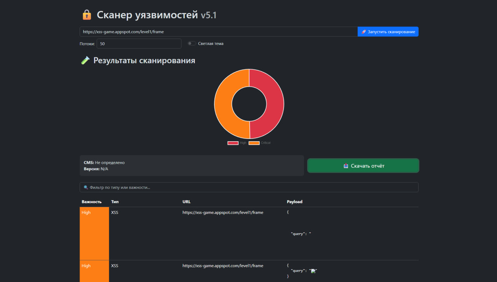
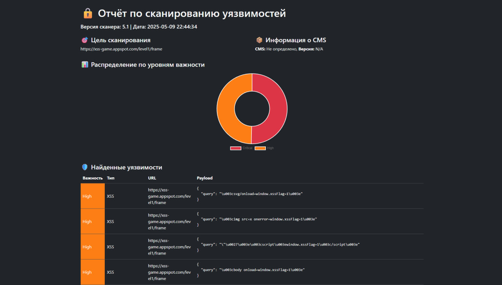

<p align="center">
  
  
  
  
  
</p>

# 🔒 Advanced Web Vulnerability Scanner 5.1

# Скриншот UI


# Пример отчета


**Интерактивный сканер уязвимостей** для веб-приложений с поддержкой SSRF, SQLi, XSS, CSRF, IDOR и других векторных атак.

---

## 🚀 Возможности

- 🛠️ Расширенное обнаружение:
  - XSS (Reflected, Stored, DOM)
  - SQL Injection (bool, blind, time-based)
  - OS Command Injection, SSRF, IDOR
  - CSRF (token detection), Path Traversal
- 🌐 Интерфейс:
  - Веб-панель с графиками (Chart.js)
  - Светлая/тёмная тема
  - Фильтрация и экспорт отчётов в **HTML/PDF**
- 🐳 Поддержка Docker
- 🧠 Обнаружение CMS (WordPress, Joomla, Drupal)

---

## 📦 Установка

```bash
git clone https://github.com/Jacksony100/web-vuln-scanner.git
cd web-vuln-scanner
pip install -r requirements.txt
python app.py
